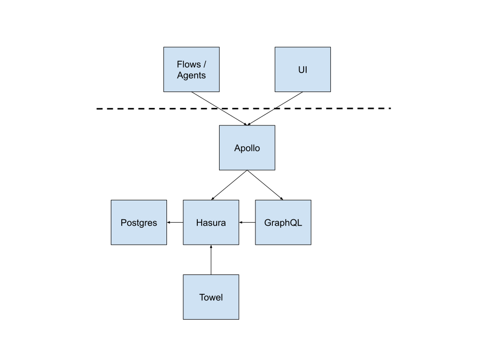
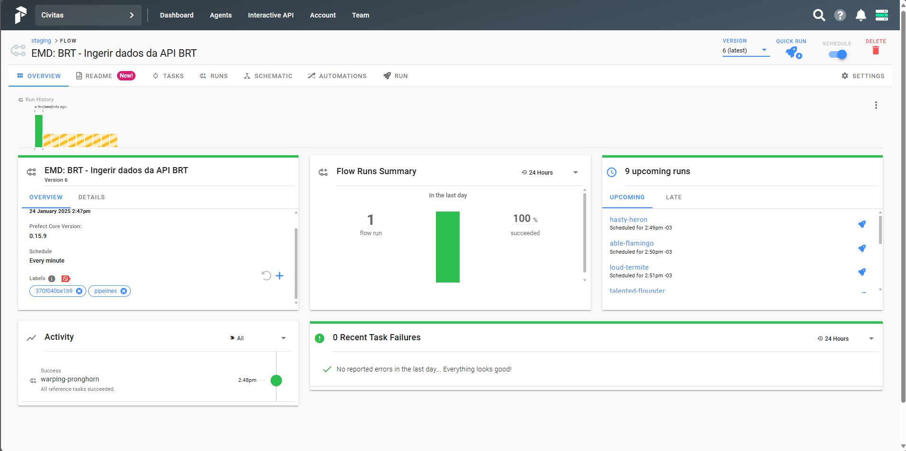

# Desafio de Data Engineer - EMD
Pipeline de Dados em Tempo Real para Monitoramento de Ônibus BRT

## Sobre o Projeto
Este projeto foi desenvolvido como parte do desafio técnico para a posição de Engenheiro(a) de Dados no Escritório de Dados do Rio de Janeiro. O objetivo é demonstrar a capacidade de construir uma pipeline de dados robusta e escalável.

## Descrição do Desafio
O projeto consiste em desenvolver uma pipeline ETL que:
- Captura dados em tempo real da API de GPS dos ônibus BRT
- Estrutura e processa os dados coletados
- Armazena os dados em diferentes camadas (CSV e PostgreSQL)
- Transforma os dados utilizando dbt para análises

## Arquitetura da Solução
A solução foi implementada como um sistema distribuído utilizando containers Docker e orquestrada pelo Prefect.

### Componentes Principais

#### Infraestrutura
- **Docker**: Containerização e isolamento dos serviços
- **Prefect**: Orquestração e monitoramento dos workflows
- **PostgreSQL**: Armazenamento dos dados processados
- **Redis**: Cache e gerenciamento de estado

#### Serviços do Prefect


- **UI**: Dashboard para monitoramento e gestão
- **Apollo**: API principal do servidor
- **PostgreSQL**: Armazenamento de metadados
- **Hasura**: API GraphQL
- **Towel**: Utilitários de manutenção
  - Scheduler
  - Zombie Killer
  - Lazarus

### Pipeline de Dados

#### 1. Ingestão (Camada Bronze)
- Coleta de dados da API BRT a cada minuto
- Dados incluem: ID do veículo, coordenadas GPS, velocidade e timestamp
- Armazenamento em arquivos CSV (rotação a cada 10 minutos)
- Carregamento para tabela PostgreSQL `bronze.brt_data`

#### 2. Transformação (Camada Gold)
- Processamento via dbt a cada 10 minutos
- Criação de materialized view `gold.vw_brt_last_info`
- Campos selecionados: ID do ônibus, posição atual e velocidade

## Requisitos
- Docker e Docker Compose
- Conta no Redis Cloud (para cache)

## Instalação e Execução

1. Clone o repositório:
```bash
git clone https://github.com/NicolasEvilasio/emd-desafio-data-eng.git
```

2. Configure as variáveis de ambiente:
Crie um arquivo `.env` na raiz do projeto com as seguintes configurações:

```env
# BRT DATABASE
DB_USER=postgres
DB_PASSWORD=postgres
DB_DATABASE=brt_db
DB_PORT=5432
DB_EXTERNAL_PORT=5433
DB_HOST=brt_postgres

# PREFECT DATABASE
PREFECT_DB_USER=prefect
PREFECT_DB_PASSWORD=test-password
PREFECT_DB_DATABASE=prefect_server
PREFECT_DB_PORT=5434

# REDIS (Insira suas credenciais do Redis Cloud)
REDIS_HOST=
REDIS_PORT=
REDIS_USERNAME=
REDIS_PASSWORD=
```

3. Inicie os serviços:
```bash
docker-compose --profile prefect --profile agent --profile pipeline up
```

## Monitoramento e Análise

### Prefect UI
- Acesse o dashboard em: http://localhost:8080
- Monitore flows e tasks em tempo real


### Análise de Dados
- Notebooks de exemplo disponíveis na pasta `analysis`  
- Visualize os dados processados na view `gold.vw_brt_last_info`  


## Estrutura do Projeto
```
.📂
├── 📂analysis/          # Notebooks para análise
├── 📂data/              # CSV coletados através da API BRT
├── 📂dbt_brt/           # Projeto dbt para transformação dos dados
├── 📂imgs/              # Imagens do README
├── 📂pipelines/         # Código fonte das pipelines
├── 📜.env
├── 📜.gitignore
├── 📜docker-compose.yml
├── 🐳dockerfile
├── 📜entrypoint.sh
├── 📜poetry.lock
├── ⚙️pyproject.toml
├── 📜README.md
```

## Contribuições
Contribuições são bem-vindas! Por favor, sinta-se à vontade para submeter um Pull Request.